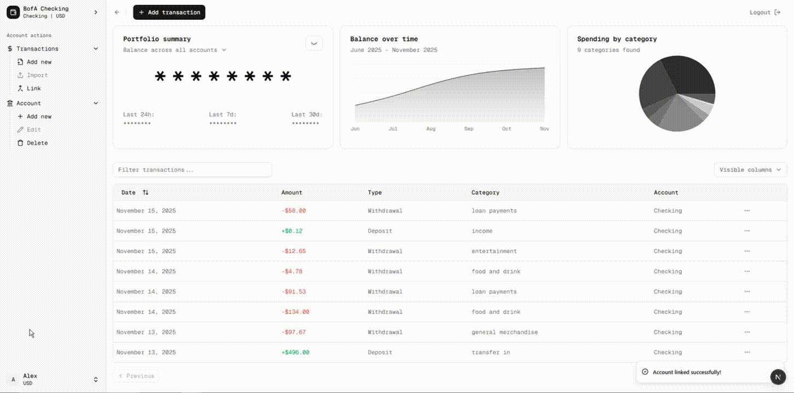

# Personal Finance Dashboard

A full-stack personal finance management application built with Next.js, TypeScript, and Supabase. This project demonstrates modern web development practices and financial data visualization.



*Dashboard featuring real-time balance tracking, transaction management, and interactive data visualization*

## Project Overview

This is a portfolio/learning project showcasing a comprehensive personal finance tracking system with support for multiple account types, transaction management, data visualization, and external banking API integration.

## Key Features

### Authentication & User Management
- **User Registration & Login**: Simple PIN-based authentication system
- **Session Persistence**: Session management with automatic rehydration
- **User Deletion**: Complete account deletion with cascade cleanup

### Multi-Account Support
- **Account Types**:
  - Checking accounts with routing numbers and overdraft limits
  - Savings accounts with interest rates and minimum balance tracking
  - Credit card accounts with credit limits, APR, and due dates
  - Investment accounts (work in progress)
- **Account Switcher**: Dynamic account selection with real-time balance updates
- **Currency Support**: USD, EUR, GBP, and JPY supported

### Transaction Management
- **Transaction Types**: Deposits, withdrawals, purchases, payments, buy/sell orders, and dividends
- **Custom Fields**: Extensible transaction schema supporting arbitrary custom fields
- **Dynamic Table Columns**: Automatically generates table columns for custom transaction fields
- **Categories**: Transaction categorization for spending analysis
- **CRUD Operations**: Full create, read, and delete functionality for transactions
- **Sorting & Filtering**: Interactive table with sortable columns

### Data Visualization
- **Portfolio Summary Card**:
  - Animated balance counter
  - Privacy mode toggle to hide sensitive information
  - 24-hour, 7-day, and 30-day performance metrics with trend indicators
  - Account-specific or portfolio-wide views
  
- **Balance Timeline Chart**:
  - 6-month historical balance visualization
  - Area chart with gradient fill
  - Responsive design

- **Spending by Category**:
  - Interactive pie chart
  - Dynamic color generation for categories
  - Automatic category detection

### External Integrations
- **Plaid API Integration**:
  - Sandbox environment testing
  - Transaction sync functionality
  - Automatic transaction conversion from Plaid format
  - Test transaction loading without persistence

### UI/UX Features
- **Sidebar Navigation**: Collapsible sidebar with user profile and account management
- **Responsive Design**: Mobile-first approach with adaptive layouts
- **Loading States**: Skeleton screens and spinners for async operations
- **Toast Notifications**: Success/error feedback using Sonner
- **Smooth Animations**: CSS animations for state transitions
- **Accessibility**: Built with Radix UI primitives for ARIA compliance

## Tech Stack

### Frontend
- **Next.js 15.5.5**: React framework with App Router
- **React 19.1.0**: Latest React features
- **TypeScript 5**: Type-safe development
- **Tailwind CSS 4**: Utility-first styling
- **Radix UI**: Accessible component primitives
- **Recharts**: Data visualization library
- **TanStack Table**: Headless table library for complex data tables
- **React Hook Form + Zod**: Form validation and management

### Backend
- **Next.js API Routes**: RESTful API endpoints
- **Supabase**: PostgreSQL database with real-time capabilities
- **Plaid API**: Banking data integration (sandbox)

### UI Components
Custom component library built with:
- Radix UI primitives (Dialog, Dropdown, Popover, etc.)
- Tailwind CSS for styling
- Lucide React icons

## Project Structure

```
src/
├── app/
│   ├── api/                    # API routes
│   │   ├── users/             # User CRUD operations
│   │   ├── accounts/          # Account management
│   │   ├── transactions/      # Transaction handling
│   │   └── link/              # Plaid integration
│   ├── dashboard/             # Main dashboard page
│   └── page.tsx               # Landing/login page
├── components/
│   ├── ui/                    # Base UI components
│   ├── account-form.tsx       # Account creation form
│   ├── account-switcher.tsx   # Account selector dropdown
│   ├── app-sidebar.tsx        # Main navigation sidebar
│   ├── chart-line.tsx         # Balance timeline chart
│   ├── chart-pie.tsx          # Category spending chart
│   ├── summary.tsx            # Portfolio summary card
│   ├── test-plaid.tsx         # Plaid testing component
│   ├── transaction-columns.tsx # Table column definitions
│   ├── transaction-form.tsx    # Transaction creation form
│   ├── transactions-table.tsx  # Data table component
│   └── user-form.tsx          # User registration/login
├── context/
│   └── UserContext.tsx        # Global state management
├── lib/
│   ├── supabase.ts           # Supabase client configuration
│   ├── types.ts              # TypeScript type definitions
│   ├── transaction-utils.ts  # Transaction helper functions
│   └── utils.ts              # Utility functions
└── hooks/
    └── use-mobile.ts         # Responsive breakpoint hook
```

## Learning Outcomes

This project demonstrates:
- Modern React patterns (hooks, context, server components)
- Type-safe API design with TypeScript
- RESTful API architecture
- Database design and querying
- External API integration
- Responsive UI design
- State management strategies
- Form validation and handling
- Data visualization
- Accessibility best practices
